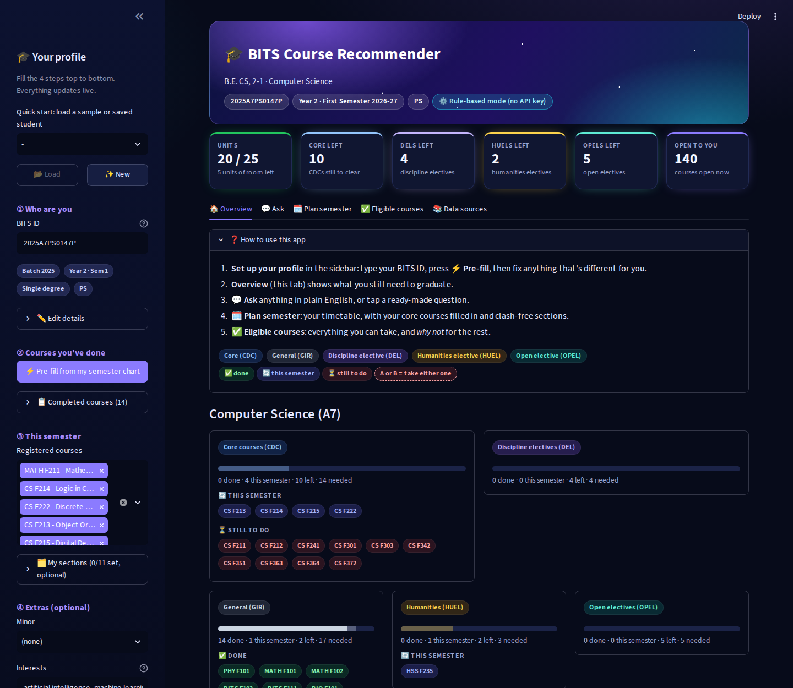
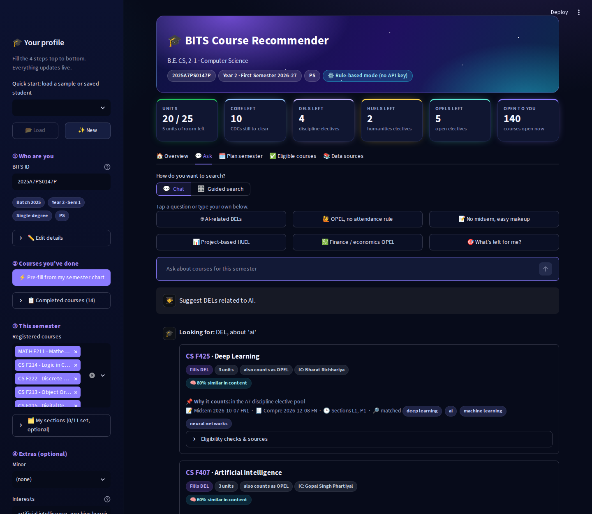
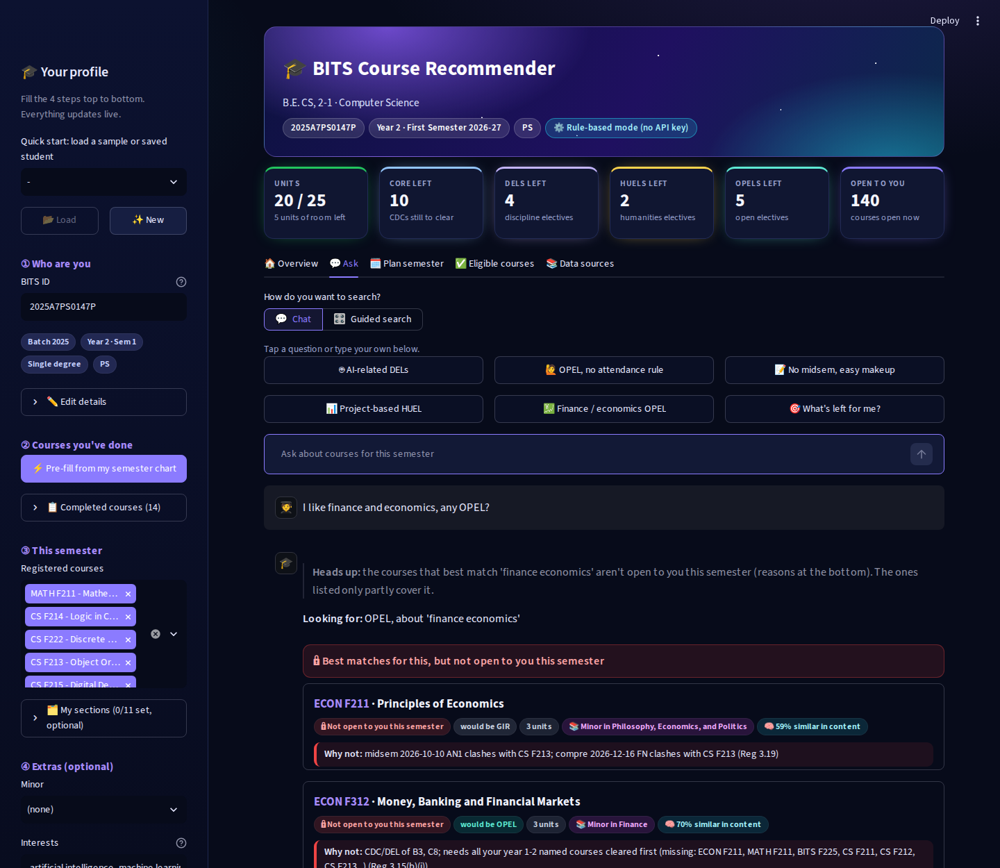
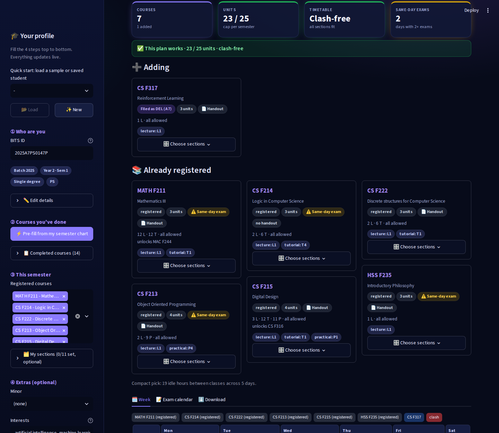

# BITS Academic Course Recommender

A course-picking assistant for BITS Pilani students, built for Postman Round 2.

You enter your BITS ID and the courses you've done. The app works out:

1. what you still need to graduate,
2. which courses in the **First Semester 2026-27** timetable you're actually allowed to take,
3. which of those match what you ask for.

Then you can ask in plain English, e.g. *"Suggest DELs related to AI"*, *"I want an OPEL with no attendance
requirement"* or *"Suggest courses with no midsem and a lenient makeup policy"*. Every suggestion says which
requirement it fills, why you're allowed to take it, the details you asked about (quoted from the handout or
timetable), and which document each fact came from.

Everything is computed live from the supplied documents. No course lists, rules or answers are hardcoded.

---

## Contents

- [Run it](#run-it)
- [Docs](#docs)
- [What it looks like](#what-it-looks-like)
- [Using the app](#using-the-app)
- [How it works](#how-it-works)
  - [1. Reading the PDFs](#1-reading-the-pdfs-ingest)
  - [2. The rules engine](#2-the-rules-engine-engine)
  - [3. The assistant](#3-the-assistant-agent)
  - [4. The dashboard](#4-the-dashboard-app)
- [Optional: AI mode](#optional-ai-mode)
- [Embedding training](#embedding-training)
- [Rebuilding the data from the PDFs](#rebuilding-the-data-from-the-pdfs)
- [Tests and test students](#tests-and-test-students)
- [Scope decisions](#scope-decisions)
- [Known limitations](#known-limitations)
- [Folder layout](#folder-layout)

---

## Run it

You need Python 3.10 or newer.

```bash
git clone https://github.com/deejay147/agentic-AI-based-BITS-Academic-Course-Recommender.git
cd agentic-AI-based-BITS-Academic-Course-Recommender
pip install -r requirements.txt
streamlit run app/app.py          # opens http://localhost:8501
```

**No API key is needed.** The processed data is already in the repo (`data/processed/`), so the app works straight
away, and every feature works without AI.

**Try it:** in the sidebar, pick **Sample · B.E. CS, 2-1** (a sample student) and click **Load**.
Open the **Ask** tab and type *Suggest DELs related to AI*, or just *finance* or *biotech*.

The first topic search downloads the small embedding model (~67 MB, once). Offline, search falls back to the
catalogue-trained model and still works.

A step-by-step guide for Windows, Mac and Linux (virtual environments, troubleshooting) is in
**[docs/RUNNING.md](docs/RUNNING.md)**.

## Docs

| | |
|---|---|
| [docs/RUNNING.md](docs/RUNNING.md) | How to install and run it, step by step, with troubleshooting |
| [docs/WRITEUP.md](docs/WRITEUP.md) | How it was built: key decisions, problems we hit and fixed, extras, limitations |
| [docs/retrieval_eval.md](docs/retrieval_eval.md) | How well interest matching works, measured against the Bulletin's minors |
| [docs/embedding_training.md](docs/embedding_training.md) | The latest embedding training run: model sizes, build times and scores |
| [docs/examples.md](docs/examples.md) | Real answers to the task's example questions on several test students (generated by a script, not hand-edited) |

## What it looks like

| | |
|---|---|
|  |  |
| Overview: what you still need to graduate, and a graduation checklist | "Suggest DELs related to AI": each row shows what it fills, why it matched, and details on demand |
|  |  |
| "I like finance and economics, any OPEL?" for a 2nd-year: Finance-minor courses, with the ones not open yet in their own panel and the rule | Planner: core courses auto-filled, one colour per course, timetable options, exam calendar |

---

## Using the app

The dashboard has a dark, minimal theme (`.streamlit/config.toml` plus a small stylesheet in `app/app.py`): the
Inter font, Material icons instead of emoji, a slim header with your ID, year and mode, and one strip of numbers
(units, core / DEL / HUEL / OPEL left, courses open to you). Details stay folded until you open them.

Each requirement type has one colour, used everywhere: CDC blue, GIR grey, DEL violet, HUEL amber, OPEL teal.
Green / red / amber mean yes / no / could not be verified. An "A or B" slot (take either one) has a dashed outline.

### Your profile (left sidebar)

1. **Type your BITS ID** (e.g. `2025A7PS0147P`). The app reads your batch, degree(s), stream and campus from it:

   | ID | Means |
   |---|---|
   | `2025A7PS0147P` | 2025 batch, B.E. Computer Science (A7), Practice School, Pilani |
   | `2024B3A70123P` | Dual degree: M.Sc. Economics (B3) + B.E. Computer Science (A7) |
   | `2025AACS0077P` | 2+2 CentraleSupélec student (CS in the stream slot), B.E. ECE |

   Since the only timetable given is First Semester 2026-27, the app knows which year and semester you're in
   (a 2025 student is in year 2, semester 1), so it never has to ask.

2. **Click "Pre-fill from my semester chart".** It fills in the courses a student in your year normally
   has done, and the ones you'd normally be taking now, from your programme's chart in the Bulletin.

3. **Edit what's different for you.** Remove courses, add electives you've done, and optionally set grades.
   A–E count as passed; NC, W, I, GA and RC count as not passed (Regulations 4.11–4.12). Pick the courses you're
   registered for this semester, and optionally which section of each under **My sections** (this makes clash
   checks exact).

4. Optionally add a **minor**, your **CGPA** and your **interests** under **Edit details**. Click **Save** to keep it.

You can also load any of the 11 sample students ("Sample · …") or a saved profile ("Saved · …") from the box at
the top.

### The tabs

| Tab | What you do there |
|---|---|
| **Overview** | See what's left: general courses (GIR), compulsory courses (CDC), DELs, HUELs, OPELs, minor progress, graduation checklist |
| **Ask** | **Chat**: tap one of six quick questions or type your own; the newest answer shows on top. **Guided search**: pick the requirement type, the handout properties you want, a topic and time preferences, then press Find |
| **Plan semester** | Your whole timetable. Core courses due this semester are auto-filled and your registered courses get sections too. **Add any course**: ones you're not allowed to take are still placed, with the rule that blocks them. Clashes are named ("ECON F211 clashes with CS F213: same midsem slot") and drawn in red. **Flip through timetable options** (Previous / Next, fewest free hours first); every course has its own colour. **Choose sections** limits a course to the sections you'd accept. Preferences: free day, no 8 AM. A month-style **exam calendar** flags days with two exams. CSV / JSON downloads |
| **Eligible courses** | Every course you can take this semester, and "Why can't I take X?" for any course, with the exact regulation |
| **Data sources** | How the data was built, what couldn't be checked, and which regulations the rules use |

### Things you can ask

- *Suggest DELs related to AI.*
- *I want an OPEL with no attendance requirement.*
- *Suggest courses with no midsem and a lenient makeup policy.*
- *I need a HUEL and prefer project-based evaluation.*
- *I like finance and economics, any OPEL?*
- *Can I take CS F317 and GS F232 together with no gaps?*
- *What are my remaining requirements?*
- *Prerequisites of CS F425*

Each suggested course is one compact row:

- **Top line:** code, title, cross-listed codes (FIN F313 = ECON F412), the requirement it fills for you
  (DEL, HUEL, OPEL, CDC…) and units
- **Why it matched:** the Bulletin group it belongs to (e.g. *Minor in Finance*), how similar its content is
  ("72% similar in content"), and the words it mentions
- **Exam dates, sections and instructor-in-charge** on one line
- **What you asked about:** small ✓ / ✗ / ? tags (yes / no / could not be verified)
- **Details** (folded): why you can take it, the quotes from the handout or timetable, and the source pages

Courses that match but you can't take yet are grouped in one **"Not open to you this semester"** panel, one line
each with the rule that blocks them (full reasons folded). When the best matches are all locked, the answer says
so first. When no course matches everything you asked for, the app shows the closest options and what each is
missing. Courses that are only close in meaning (not in a matched group) are marked *related*.

---

## How it works

```
   PDFs  ──►  1. ingest/   read the PDFs once, save clean data + a small database
                     │
 profile ──►  2. engine/   what's left to graduate? what am I allowed to take? any clashes?
                     │         (plain Python, no AI; same answer every time)
                     │
question ──►  3. agent/    understand the question → search only the allowed courses
                     │         → double-check every pick against the engine → explain
                     │
              4. app/      the Streamlit website
```

The most important design choice: **rules are checked by plain code, not by AI.** The AI part (optional) only
helps understand the question, match interests to courses, and word the answer. Every course it suggests is
checked again by the rules code before you see it, so it can't recommend a course you're not allowed to take.

### 1. Reading the PDFs (`ingest/`)

This step runs once and turns the supplied PDFs into clean, structured data. Every record keeps its source
(document, page or file), so any fact the app shows can be traced back.

| Script | Reads | Produces |
|---|---|---|
| `timetable.py` | Timetable | 719 course rows (582 course codes), 1,557 sections with their days and hours, midsem and compre slots, instructor-in-charge, and 167 groups of "equivalent" courses (same course, different codes) |
| `bulletin_programmes.py` | Bulletin, programme pages | 28 degree programmes: compulsory courses (CDCs), elective lists (DELs), general courses (GIRs), where each course sits in the semester chart, and required counts. Also 70 combined dual-degree charts, 136 HUEL courses and 23 minors |
| `bulletin_courses.py` | Bulletin, course descriptions | 2,015 courses with title, units, description and stated prerequisites |
| `handouts.py` | 540 handout PDFs (399 after removing duplicates) | Marks breakdown, whether there's a midsem / compre / quizzes / project / lab / open book, makeup policy, attendance policy, recommended background, and lecture topics. Each fact keeps the sentence it came from |
| `regulations_rules.py` | Academic Regulations | The 14 regulation clauses the rules use |
| `build_db.py` | All of the above | `academic.db` (SQLite database), `validation_report.md`, `verification_queue.csv` |

**How the PDFs are read.** Tables in PDFs are just words placed at positions on a page, so copying the text out
mixes up columns and rows. Instead, the timetable and Bulletin are read using the **position of every word**
(pdfplumber): left-right position decides the column, height decides the row. The Bulletin's two-column pages are
cut down the middle and read one column at a time. Handouts are all written differently, so they're read by
finding headings (like "Evaluation Scheme") and reading what's under them. A marks table is only trusted if it
adds up to about 100%.

**Nothing is guessed.** Anything that can't be read reliably goes into `verification_queue.csv` (108 items: e.g.
53 offered courses without a handout, 21 timetable courses with no class times). In the app, a missing fact shows
up as *could not be verified*, never as a guess.

### 2. The rules engine (`engine/`)

Plain Python, no AI. Given a student, it answers "what's left?" and "what can I take?".

| File | What it does |
|---|---|
| `profile.py` | Reads the BITS ID; stores completed courses (with optional grades), registered courses, sections, minor, interests |
| `requirements.py` | Works out what's left to graduate and files each elective into the right bucket |
| `eligibility.py` | Checks every timetable course against the rules below, and records why a course is blocked |
| `schedule.py` | Clash checks and choosing sections so nothing overlaps |
| `planner.py` | The semester planner |
| `chart.py` | Reads the semester charts (used for pre-fill and the "earlier courses" rule) |

**What's left to graduate.**

- A single degree needs 3 HUELs, 4 DELs and 5 OPELs.
- A dual degree has no OPEL requirement, because the DELs of one degree count as OPELs of the other
  (Regulation 2.05).
- If a programme's chart asks for a different number (Economics needs 6 DELs, Biotechnology 5), the chart's
  number is used.
- Each elective you've done is placed in the first bucket it fits: DEL first, then HUEL, then OPEL
  (Regulation 2.05).
- A HUEL can't be from your own department.
- Courses that were renamed or cross-listed are matched through the timetable's equivalent-course list.
- You also get a graduation checklist and progress towards your minor. 2+2 CentraleSupélec students get the
  condition they need to meet to go abroad (Bulletin p.160).

**What you're allowed to take.** Every course in the timetable is checked against these rules. Each rule is tied
to the regulation it comes from, so "Why can't I take X?" gets an exact answer.

| Rule | Regulation |
|---|---|
| You've passed the course's prerequisites (only about 70 courses list any) | 3.13 |
| For your own compulsory courses, you've done the earlier-semester ones (the DCA may allow up to two missing) | 3.14 |
| You can take another programme's CDCs/DELs only after finishing your own years 1–2 (applied strictly) | 3.15(b)(i) |
| Higher-degree courses: only in your own discipline, after your 2nd-year compulsory courses, at most one per semester. The CGPA cutoff isn't in the data, so the app notes it | 3.15(b)(ii), 2.08 |
| At most 25 units in a semester | 1.01 |
| First-year foundation courses can't be taken as electives | 2.07, 3.18 |
| Some new course codes (comcod 5000+, U-codes) are only for 2026 admits | Timetable note |
| No clash in classes or exams | 3.19 |

**Timetable intelligence (bonus).** The app checks clashes in lectures, tutorials, labs, midsems and compres. If
one section of a course clashes with your timetable, it tries the other sections before rejecting the course. It
does this by trying section combinations one by one and backing up when it hits a clash (called
*backtracking*; fast here because a semester has only ~6 courses). On top of that you can ask for:

- **no 8 AM classes**
- **a weekday kept free**
- **a compact timetable:** clash-free choices are ranked by the fewest free hours stuck between classes, then
  the fewest days on campus

This works from the planner tab and from chat, e.g. *"can I take CS F317 and GS F232 together with no gaps?"*.

The planner tab builds the whole semester, not just the new courses:

- **Core courses are auto-filled.** CDC / GIR courses the chart puts in this semester (or earlier) that are still
  open and allowed are added. Cross-listed codes and "A or B" slots count once. Turn it off to plan only your picks.
- **Sections are chosen for registered courses too**, keeping any section you gave, so the week is complete.
- **Add any course.** If it doesn't fit, the app says what it collides with. It adds courses one at a time, keeps
  the ones that fit, and names the pair that clashes. Courses you aren't allowed to take are still placed, marked
  with the blocking rule.
- **Timetable options.** Up to 30 different clash-free section combinations for the same courses, best (fewest
  free hours between classes) first. You flip through them with **Previous / Next**. To get varied options, the search is re-run
  with the section order shuffled (seeded, so it's reproducible).
- **Choose sections**, borrowed from the DVM timetable tool: pick the sections you'd accept for any course (none = any).
  The planner only uses those.
- Course cards show section counts ("2 L · 6 T"), prerequisites, what the course unlocks, and a **same-day exam** flag.
- The **exam calendar** is a month-style grid of your midsem and compre dates, in the same colours as the week.
  The timetable, exams and plan can be downloaded as CSV / JSON.

### 3. The assistant (`agent/`)

| File | What it does |
|---|---|
| `tools.py` | The five tools the assistant uses (below), and the final double-check |
| `retrieval.py` | Keyword search, topic scoring (keywords + semantic model + minor/department boost), handout property checks |
| `semantic.py` | The semantic course model trained on the catalogue (LSA) |
| `embeddings.py` | Contextual sentence embeddings of every course (bge-small via fastembed) |
| `train_embeddings.py` | Retrains / rebuilds both models and re-runs the evaluation ([Embedding training](#embedding-training)) |
| `nlu.py` | The built-in question parser used in no-key mode |
| `agent.py` | Runs the conversation in either mode, and formats the answers |

**The tools.**

- `get_requirements`: what's left for this student
- `find_courses`: search the **allowed** courses by type (DEL/HUEL/OPEL), properties (no midsem, no attendance…),
  time (no 8 AM, free day) and topic
- `course_details`: everything about one course, including why you can or can't take it
- `check_plan`: do these courses fit together in the timetable?
- `submit_recommendations`: the final answer

**The double-check.** Before any suggestion is shown, it's checked again. It's dropped if you aren't allowed to take
it, if it doesn't count as what you asked for (you asked for a DEL and it would be an OPEL), or if the handout says
the opposite of what you asked for.

**Topic search (interest matching).** Search matches *meaning and context*, not just shared words. Every course has a
text: title, Bulletin description and handout lecture plan. Its score for your topic combines:

1. **Contextual embeddings, weight 0.6** (`agent/embeddings.py`). A pretrained sentence-embedding model
   (**BAAI/bge-small-en-v1.5**, 33M parameters) turns each course text and your query into 384-number vectors, so
   "investing in stocks" lands next to *Security Analysis and Portfolio Management* even with no word in common. It
   runs on ONNX Runtime through `fastembed`: no PyTorch, no GPU. Only the supplied course texts are embedded; the
   vectors are saved in `data/processed/embeddings.npz`, and the model (~67 MB) is downloaded once, the first time a
   query is embedded.
2. **A model trained on the catalogue, weight 0.15** (`agent/semantic.py`). Latent semantic analysis over the
   ~2,100 course texts learns BITS's own vocabulary (finance ≈ investors, capital, equity). It also works fully offline
   if the embedding model can't be loaded.
3. **Keywords (BM25), weight 0.25.** Your words plus synonyms, counted in the course text.
4. **The Bulletin's own topic groups.** Every minor, department and programme elective pool is a topic. Your query
   is matched to groups by name, by synonym, or by how close it is to the group's courses. "finance" → Minor in
   Finance, FIN department, Economics electives; "biotech" → BIO / BIOT departments, Biotechnology electives. **Every
   offered course in a matched group is listed**: the ones you can take, then the ones you can't yet, with the rule.

Rows show why each course matched: the group, the % similarity in content, and the matched words. Cross-listed
codes are shown together (FIN F313 = ECON F412).

**How good is it?** `python -m tests.eval_retrieval` writes [docs/retrieval_eval.md](docs/retrieval_eval.md). There
are two tests, both with ground truth taken from the Bulletin:

- **Ranking:** each minor's name is the query, and its courses are the right answers, ranked among all 582 offered
  courses.

  | | Precision@5 | Recall@10 | MRR |
  |---|---|---|---|
  | Keywords only | 0.29 | 0.37 | 0.50 |
  | Keywords + LSA | 0.34 | 0.44 | 0.54 |
  | Keywords + LSA + embeddings (used) | 0.36 | 0.47 | 0.66 |

- **Everyday wording:** 19 queries like "investing and stock markets", "movies and journalism", "starting a company".
  The expected group was found for all 19, and all its offered courses came back. These queries were used while
  tuning the matching, so treat this as a check, not an unseen test.

**Course properties.** Each property check gives one of three answers:

- **yes:** the handout or timetable says so (quote shown)
- **no:** it says the opposite (quote shown)
- **could not be verified:** it doesn't say. The answer then reads *"No specific information mentioned; contact the
  Instructor-in-Charge (name)"*

**Two modes.**

- **No-key mode (default).** The built-in parser works out what you're asking for: the kind of answer (suggest
  courses, show requirements, course details, check a plan), the elective type, properties, time preferences,
  course codes and topics. The same tools answer it, and the explanation comes from templates.
- **AI mode (optional).** A language model reads the question, calls the same tools (for example, turning "AI" into
  syllabus words and searching again if results are thin), picks and orders the courses, and writes the
  explanation. Every pick still goes through the double-check. See [Optional: AI mode](#optional-ai-mode).

### 4. The dashboard (`app/`)

A Streamlit website (`app/app.py`): the profile sidebar and the five tabs described in
[Using the app](#using-the-app). Profiles are saved as small JSON files in `data/profiles/`.

---

## Optional: AI mode

Without a key the app uses its built-in parser. With a key, an AI model does the understanding and wording. The
rules and the double-check stay the same.

| Provider | Cost | Where to get a key | Default model |
|---|---|---|---|
| Google Gemini | Free tier | Google AI Studio | `gemini-3.8-flash` |
| Groq | Free tier | Groq console | `llama-3.3-70b-versatile` |
| Anthropic (Claude) | Paid | Claude console | `claude-sonnet-5` |
| Any OpenAI-compatible server | Varies | — | set `LLM_MODEL` |

There are two ways to add a key:

- **Quick:** in the sidebar, open **AI mode (optional)**, pick the provider and paste the key. It's only kept for that
  browser session.
- **Permanent:** copy `.env.example` to `.env` and fill in one line, e.g. `GEMINI_API_KEY=...`. You can also set
  `LLM_PROVIDER`, `LLM_MODEL` and `LLM_BASE_URL`. `.env` is git-ignored, so keys never get committed.

The pill at the top right shows which mode is on ("Rule-based · no API key" or "AI · provider"). If the AI call fails (wrong key, out of quota, no internet),
the answer falls back to no-key mode and says so at the top.

## Embedding training

The two search models are built from the supplied course texts only (title + Bulletin description + handout
lecture plan). Both are committed in `data/processed/`, so you don't need to run this to use the app.

```bash
python -m agent.train_embeddings             # train LSA, rebuild the embedding index, evaluate (a few minutes on CPU)
python -m agent.train_embeddings --lsa-only  # only retrain the LSA model (seconds)
```

| Step | What happens | Output |
|---|---|---|
| 1. LSA training | TF-IDF over ~2,100 course texts (12,000 terms, instructor names removed), reduced to 100 hidden "topic" dimensions with SVD | `semantic.npz` |
| 2. Embedding index | bge-small-en-v1.5 turns every course text into a 384-number vector. The model's weights are **not** changed (it's pretrained); what's built is the index of course vectors | `embeddings.npz` |
| 3. Evaluation | Re-runs `tests/eval_retrieval.py` against the Bulletin's minors and the plain-English topics | `docs/retrieval_eval.md` |
| 4. Report | Sizes, build times and scores of this run | `docs/embedding_training.md` |

`python -m ingest.run_all` runs this as its last step, so rebuilding the data always rebuilds the models too.

**Is this allowed?** The task says to use only the supplied dataset. The embedding model is used as a tool (like
the PDF reader): it adds no course facts, and only the supplied course texts are embedded. No outside course data,
forum posts or web pages are used.

## Rebuilding the data from the PDFs

Only needed for a new timetable or new handouts. The engine and assistant code don't change.

1. Put the files in `data/raw/` (not committed; about 250 MB):
   ```
   data/raw/bulletin.pdf
   data/raw/timetable.pdf
   data/raw/regulations.pdf          # Academic-Regulations-2023.pdf, renamed
   data/raw/handouts/*.pdf
   ```
2. Install poppler for the `pdftotext` tool. Tesseract is optional; it's only for the one scanned handout.
3. Run:
   ```bash
   python -m ingest.run_all          # a few minutes; the last step is embedding training
   ```
4. Check `data/processed/validation_report.md` for the counts and `verification_queue.csv` for anything flagged.

## Tests and test students

```bash
pytest -q                          # 42 tests
python -m agent.train_embeddings   # retrain the search models + evaluate -> docs/embedding_training.md
python -m tests.eval_retrieval     # search quality -> docs/retrieval_eval.md
python -m tests.run_examples       # regenerates docs/examples.md
```

The tests cover requirements, every rule, clashes, section choice, the planner (including allowed sections,
registered courses and clash explanations), dual degrees, minors, the question parser, topic search ("finance"
must return the Finance minor's courses and nothing unrelated) and both AI modes. The AI modes are tested with fake AI clients that return scripted answers,
including a deliberately invalid pick, to check the double-check drops it.

There are 11 test students in `tests/profiles/`, chosen to cover different cases:

| Profile | Why it's there |
|---|---|
| `cs_2nd_year` | Main demo student, B.E. CS |
| `mech_2nd_year`, `pharm_2nd_year` | Other single degrees |
| `chem_3rd_year_nc` | Has an NC (not cleared) grade in a compulsory course |
| `ece_3rd_year` | 3rd year, can take other programmes' courses |
| `eee_3rd_year_ds_minor` | Doing the Data Science minor |
| `civil_4th_year_2023` | Older batch (gets the curriculum note) |
| `csp_ece_2nd_year` | 2+2 CentraleSupélec student |
| `dual_b5a3_2nd_year`, `dual_b3a7_3rd_year`, `dual_b4a4_4th_year` | Dual degrees in years 2, 3 and 4. The 3rd-year one is already at 23 units, so almost nothing fits and the app has to explain why |

## Scope decisions

- **Curriculum:** the supplied Bulletin (2025-26) is used for everyone. Older batches see a note saying so and still
  get results. 2026 admits are treated the same way, and only they see the 2026-only course codes.
- **Campus:** Pilani only (the timetable and handouts are Pilani's).
- **Prerequisites:** when a course has none, the app says "No prerequisites required" only if you ask.
- **Regulation 3.15(b)(i)** is applied strictly.
- **2+2 CentraleSupélec:** the app shows the condition to go abroad (CGPA ≥ 5.0, no grade below D). The supplied
  data doesn't say which BITS courses count for CSP.
- **Practice School / thesis** appear in the graduation checklist as a reminder only.

## Known limitations

- **Handouts:** 287 of 399 handouts have a marks table the app can read cleanly. For the rest it shows the
  handout's own text instead of numbers. Makeup and attendance answers always come with the quoted sentence.
- **Clash checks** are exact only if you enter your sections for registered courses that have more than one
  section. Otherwise the app blocks only the times it knows for sure and tells you which ones it couldn't check.
- **Source gaps:** the Bulletin disagrees with itself for 3 programmes (ECE, Environmental & Sustainability, BBA),
  and 21 timetable courses have no class times. These are listed in `verification_queue.csv`, not guessed.
- **Not in the data:** the CGPA cutoff for higher-degree courses, and the CSP course mapping. The app says so.

## Folder layout

```
ingest/           PDF readers, database build, validation report
engine/           requirements, eligibility rules, clashes, planner (no AI)
agent/            tools, topic search, LSA + embedding models and their training, question parser, AI loop
app/              the Streamlit website
tests/            test students (JSON), tests, example and screenshot scripts
data/processed/   the processed data, academic.db and the two search models (committed)
data/raw/         the original PDFs (not committed)
docs/             run guide, writeup, search evaluation, training report, examples, screenshots
```
